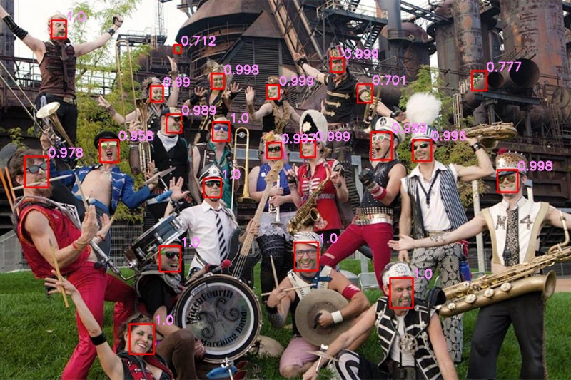
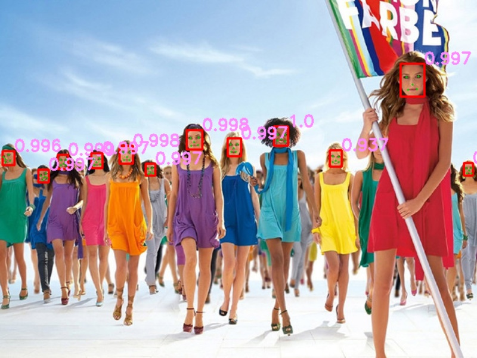

# Simple-MTCNN

This is a simple implementation of MTCNN, without train script. It is used to understand the algorithm described in the paper 
[a Joint Face Detection and Alignment using Multi-task Cascaded Convolutional Networks.](https://arxiv.org/abs/1604.02878) 
Pre-trained files(.npy) and some code is from [facenet](https://github.com/davidsandberg/facenet).

## Environment
+ python 3.6
+ Tensorflow-gpu 1.13.1
+ cuda 10
+ opencv 4.1.0

## Test
+ demo_picture.py: to deal with prepared pictures.
+ demo_picture.py: to deal with online video.

## Result

